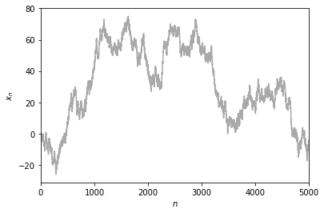
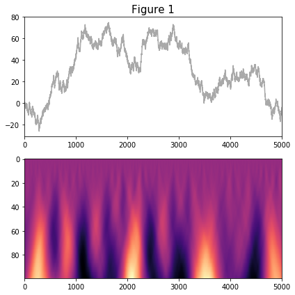
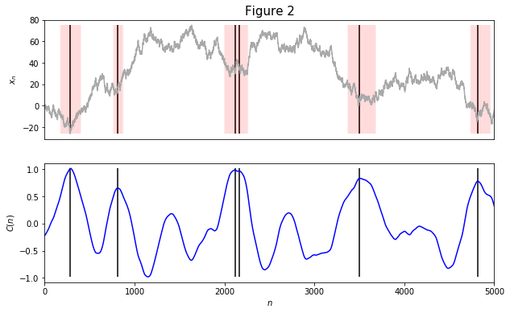

# Discrete Shocklet Transform (DST) and Shocklet Transform And Ranking (STAR) algorithm
## A qualitative, shape-based, timescale-invariant methodology for finding shapes in sociotechnical data

## Associated Paper(s):
 - [Published Version](https://link.springer.com/article/10.1140/epjds/s13688-020-0220-x)
 - [Arxiv Preprint](https://arxiv.org/abs/1906.11710)

## Installation
This repo may be installed using pip:
```bash
pip install git+https://gitlab.com/compstorylab/discrete-shocklet-transform.git
```

Or, if you would like to interact more with Git:
```bash
git clone https://gitlab.com/compstorylab/discrete-shocklet-transform
cd discrete-shocklet-transform
pip install -e .
```

## Primary Features
After installation you will have access to `discrete_shocklets`, which has all 
of the tools you need in order to computer the discrete shocklet transform on
arbitrary time series data. See `discrete-shocklet-transform/example/example.ipynb`
for an application of some of the functionality found in `discrete_shocklets`.

In addition to the library, a command line tool is also provided that should
facilitate rapid application of the STAR algorithm to arbitrary time series data.
The `star` command line tool should be available on your path following installation.
Use `star -h` to get an overview of the different options, and be sure to note
the gotchas discussed below.

## Basic DST Usage
### Start with some time series data


### Apply the DST


### Threshold the DST to identify regions of interest


## Citing this repo
If you use this code as a part of academic research then please cite one or both of the associated papers listed above.
Here is the `bib` entry associated with the published paper.
```
@article{dewhurst2020shocklet,
  title={The shocklet transform: a decomposition method for the identification of local, mechanism-driven dynamics in sociotechnical time series},
  author={Dewhurst, David Rushing and Alshaabi, Thayer and Kiley, Dilan and Arnold, Michael V and Minot, Joshua R and Danforth, Christopher M and Dodds, Peter Sheridan},
  journal={EPJ Data Science},
  volume={9},
  number={1},
  pages={3},
  year={2020},
  publisher={Springer Berlin Heidelberg}
}
```

## `star` gotchas
Additional arguments passed to `star` following the named arguments are considered to be kernel function arguments.
Using the default settings, `star -i example` will throw the following error:
```
Error occurred in computation of shocklet transform of test
Error: power_cusp() missing 1 required positional argument: 'b'
```

The default kernel function (`power_cusp`) has a required argument that must be filled by the user.
This can be done like so:
```bash
star -i example 3
```
